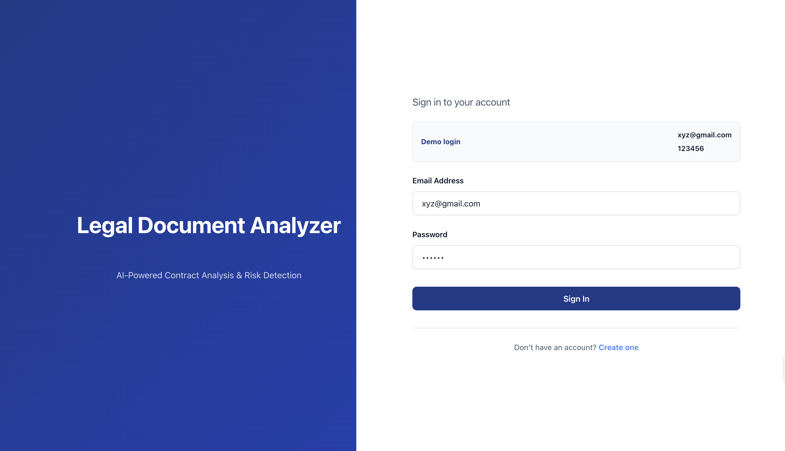
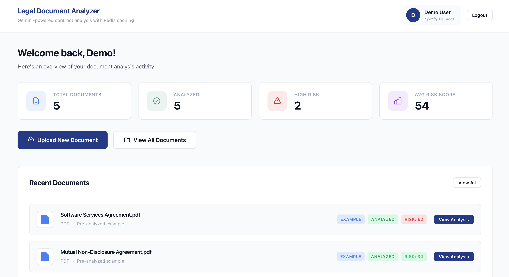
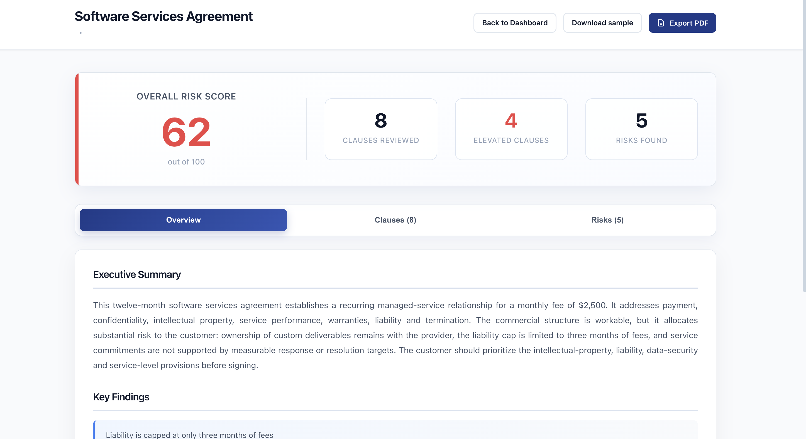
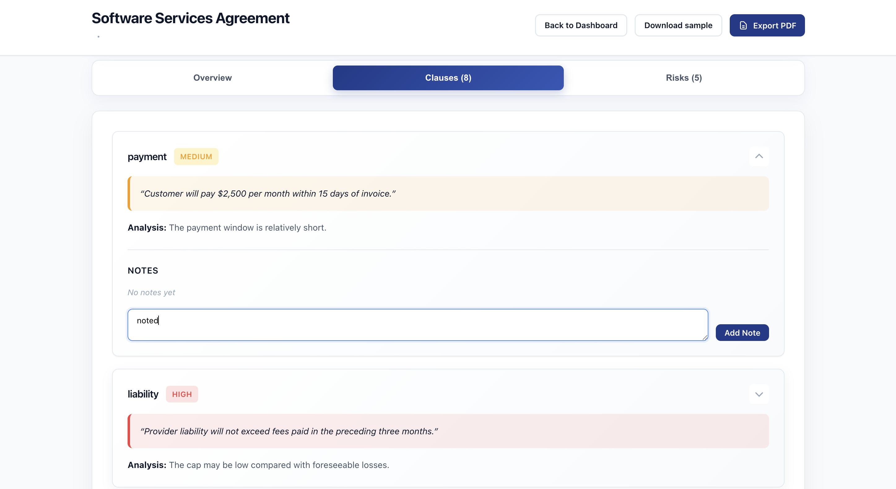
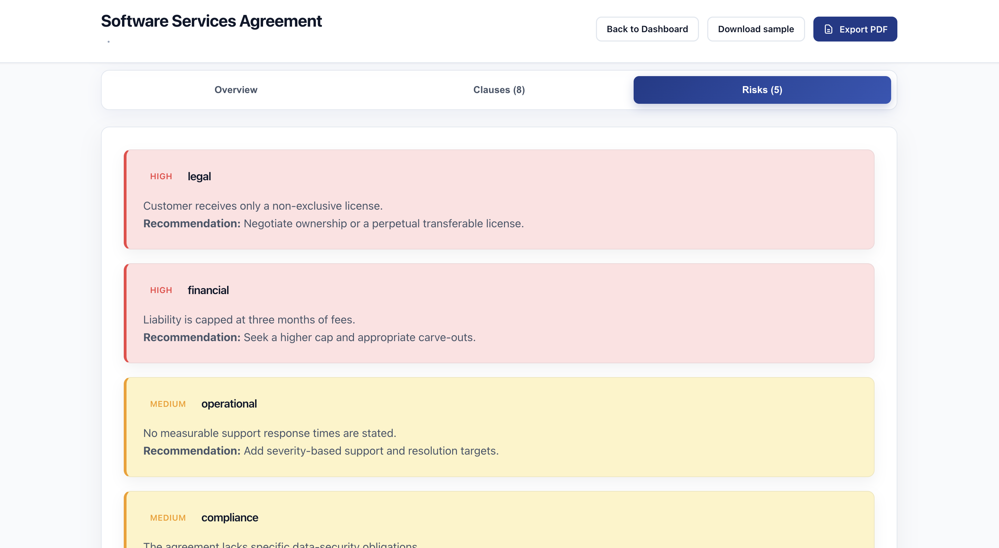
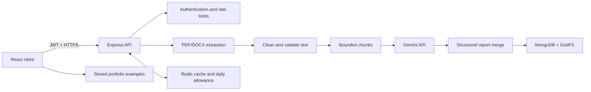

# Legal Document Analyzer

<p align="center">
  <strong>AI-assisted contract review with structured risks, clause-level insights and portfolio-ready example reports.</strong>
</p>

<p align="center">
  
  
  
  
  
</p>

Legal Document Analyzer is a full-stack portfolio application that converts PDF and DOCX agreements into concise, structured review reports. It extracts and cleans document text, analyzes bounded chunks with Gemini, combines the results, highlights important clauses and risks, and lets users save notes or export a formatted PDF report.

The project includes five fictional, pre-analyzed portfolio examples, so the complete review experience remains available even when live AI quota is unavailable.

> **Important:** AI-generated output is informational and is not legal advice. Never upload confidential, privileged, personal or commercially sensitive documents to a public demo.

## Highlights

- Structured executive summary, findings, clause analysis and risk register
- Risk severity scoring with actionable recommendations
- PDF and DOCX text extraction with input cleaning
- Bounded chunk processing for large documents
- Token and output limits to reduce latency and API usage
- Duplicate-analysis protection and cached completed results
- Clause-level notes and downloadable PDF reports
- Five detailed fictional documents with stored analyses
- JWT authentication and server-side API keys
- MongoDB/GridFS document storage
- Redis-backed cache, daily AI allowance and abuse protection
- Clear invalid-file, quota, rate-limit and provider error states
- Responsive React interface with progress and loading feedback

## Product walkthrough

The demo account opens directly into a populated document workspace. Recruiters can inspect five completed examples—including a software services agreement, mutual NDA, employment offer, residential lease and freelance design agreement—without consuming AI quota. Each example includes the source document, executive summary, key findings, clause-level analysis, risks, recommendations, notes and PDF export.

**Demo account**

```text
Email:    xyz@gmail.com
Password: 123456
```

The demo account is created automatically when `ENABLE_DEMO_ACCOUNT=true`.

## Screenshots

### Demo access



### Document workspace



### Structured analysis overview



### Clause review and notes



### Risk register and recommendations



## Architecture



API keys remain in the backend environment. The browser never receives the Gemini, MongoDB, Redis or JWT secrets.

## Technology

| Layer | Technology |
|---|---|
| Frontend | React 19, React Router, responsive CSS |
| Backend | Node.js, Express |
| AI | Google Gemini 2.5 Flash |
| Database | MongoDB Atlas, Mongoose, GridFS |
| Cache and limits | Redis / Upstash, Bull |
| Document extraction | pdf-parse, Mammoth |
| PDF reports | PDFKit and browser print export |
| Authentication | JWT, bcrypt |
| Testing | Node test runner, React Testing Library |

## Analysis pipeline

1. Validate file type, upload size and ownership.
2. Store the original document in GridFS.
3. Extract and normalize readable text.
4. Reject empty, image-only or oversized documents.
5. Split text on paragraph and word boundaries.
6. Analyze each bounded chunk with capped output tokens.
7. Merge partial results into one non-duplicative JSON report.
8. Validate and store the report in MongoDB.
9. Cache completed results and expose progress to the client.

Default portfolio limits:

| Control | Default |
|---|---:|
| Maximum upload size | 10 MB |
| Maximum document pages | 80 |
| Maximum extracted characters | 140,000 |
| Maximum chunks | 12 |
| Characters per chunk | 12,000 |
| Output tokens per chunk | 900 |
| Final merge output tokens | 1,800 |
| Public live analyses | 1 per UTC day |

## Local development

### Prerequisites

- Node.js 18 or newer
- MongoDB local instance or Atlas connection
- Gemini API key for live analysis
- Redis connection URL (recommended, but optional locally)

### 1. Clone the repository

```bash
git clone https://github.com/thanujaa9/Legal-Document-Analyzer.git
cd Legal-Document-Analyzer
```

### 2. Start the backend

```bash
cd backend
cp .env.example .env
npm install
npm test
npm start
```

The API runs at `http://localhost:8081`.

### 3. Start the frontend

Open another terminal:

```bash
cd frontend
cp .env.example .env
npm install
npm start
```

Open `http://localhost:3000`.

## Environment variables

### Backend

| Variable | Required | Purpose |
|---|---|---|
| `MONGODB_URI` | Yes | MongoDB connection string |
| `JWT_SECRET` | Yes | JWT signing secret, at least 32 random characters |
| `FRONTEND_URL` | Yes | Allowed frontend origin or comma-separated origins |
| `GEMINI_API_KEY` | For live AI | Server-side Google AI Studio key |
| `GEMINI_MODEL` | No | Defaults to `gemini-2.5-flash` |
| `REDIS_URL` | Recommended | TLS Redis URL for cache and shared limits |
| `ENABLE_DEMO_ACCOUNT` | No | Creates the portfolio demo login |
| `DAILY_LIVE_ANALYSIS_LIMIT` | No | Global daily allowance; defaults to `1` |
| `ANALYSES_PER_USER_PER_HOUR` | No | Additional per-user abuse limit |

### Frontend

| Variable | Required | Purpose |
|---|---|---|
| `REACT_APP_API_URL` | Yes | Backend URL ending in `/api` |

Copy the provided `.env.example` files. Never commit `.env`, API keys, database credentials, Redis URLs or JWT secrets.

### Gemini API key

1. Open [Google AI Studio](https://aistudio.google.com/app/apikey).
2. Create a key for your Google Cloud project.
3. Save it only as `GEMINI_API_KEY` in the backend environment.
4. Restart the backend.

Free-tier availability and quotas are controlled by Google and may change. The application handles missing keys and exhausted quota without disabling stored example reports.

## Testing

Backend tests cover text cleanup, safe chunking, empty input, provider-error classification, missing API keys, daily allowance enforcement and repeated-request rate limiting.

```bash
cd backend
npm test
```

Frontend verification:

```bash
cd frontend
CI=true npm test -- --runInBand
npm run build
```

## Deployment

Recommended portfolio deployment:

- **Frontend:** Vercel
- **Backend:** Railway or a non-sleeping Render web service
- **Database:** MongoDB Atlas
- **Redis:** Upstash Redis

The repository also includes `render.yaml` for a Render Blueprint deployment.

Configure these secrets in the hosting dashboards—not in GitHub:

```text
MONGODB_URI
JWT_SECRET
GEMINI_API_KEY
REDIS_URL
FRONTEND_URL
REACT_APP_API_URL
```

For production, use HTTPS origins, restrict database credentials, rotate exposed tokens, retain the daily analysis cap and monitor Gemini usage. Free Render backend instances sleep after inactivity, so the first API request may be slow.

## Known limitations

- Scanned or image-only PDFs require OCR, which is not included.
- Legacy `.doc` files must be converted to `.docx`.
- Legal analysis can be incomplete or inaccurate and requires professional review.
- Public live AI features can consume quota; authentication and rate limits reduce but do not eliminate abuse.
- Uploaded documents remain in MongoDB/GridFS until deleted.

## Security notes

- Secrets are loaded only from backend environment variables.
- Upload types and sizes are validated before processing.
- Routes enforce document ownership.
- Authentication, upload and analysis endpoints are rate limited.
- Duplicate Analyze requests are locked to prevent repeated provider calls.
- Redis credentials and API keys are never printed intentionally.

## License

This project currently uses the package-level ISC license declaration. Add a root `LICENSE` file before presenting it as reusable open-source software.

---
